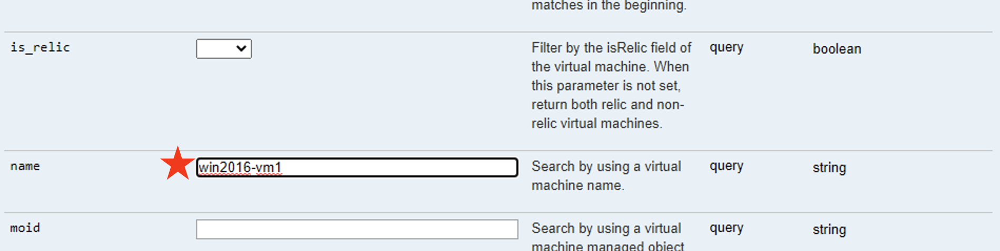
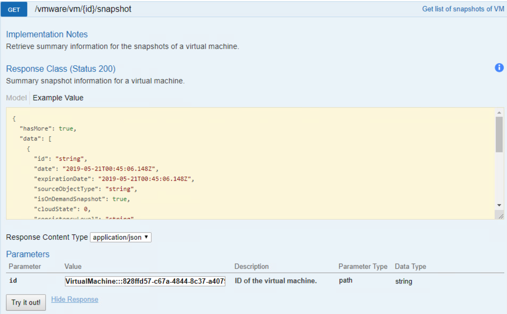

| Difficulty level: Intermediate |
| --- |

# Lesson 1: Async Requests

Not all requests can be processed immediately. In those cases, the API uses an async request to provide a tracking URL for you to check in on the request to see how it is progressing.

In this lab, we will be creating a live mount. To do this, we will need to gather the id value of a virtual machine resource, then determine what snapshots exist for the virtual machine, and then finally request that the latest snapshot be used for a live mount.

We will then track the status of this request using the async request endpoint until the live mount is powered on and available.

## Lesson 1-1: Authentication

In Google Chrome, open a new tab and type `https://$cluster_address/docs/v1/playground`. The node IP information can be found in [Lab Topology](/lab-topology.md).

The Rubrik REST API Explorer web page opens.

1. Click on the green Authorize button in the upper right corner.
2. Supply your username and password. Enter the Rubrik CDM credential information found in [Lab Topology](/lab-topology.md).
3. Click **Authorize**.

Once authorized, the page will reload and the supplied credentials will be used for subsequent requests.

## Lesson 1-2: Get the VM ID

In Google Chrome, use the existing tab with the REST API Explorer. Navigate to the `vmware/vm` set of endpoints and expand the `GET /vmware/vm` endpoint.

Scroll down to the list of query parameters. Enter the value `win2016-vm1` into the **name** parameter.

Continue to scroll down to the bottom of the endpoint page and click the **Try it out!** button.

The Response Body should return with a large quantity of JSON formatted data. This contains details on any virtual machines matching the name `win2016-vm1`. In this case, there is only a single virtual machine matching this name, so only one resource object is returned.

Look through the Response Body to find the `id` value. Record the value. This is the globally unique id value for the virtual machine.

## Lesson 1-3: Getting the VM Snapshot ID

In Google Chrome, use the existing tab with the REST API Explorer. Navigate to the `vmware/vm` set of endpoints and expand the `GET /vmware/vm/{id}/snapshot` endpoint.

Use the virtual machine `id` value recorded in Lesson 1-2 in the `id` parameter field and click **Try it out!**. This will retrieve a list of all known snapshots for this virtual machine resource object.

The Response Body displays each snapshot in an ordered array starting with the most recent snapshot. You can validate this by looking at the `date` key and checking the value. Other important information, such as the snapshot's `slaName` and `indexState` can help you understand more details on the snapshot.

Record the most recent snapshot's `id` value for the next lesson.

## Lesson 1-4: Requesting a Live Mount

In Google Chrome, use the existing tab with the REST API Explorer. Navigate to the `vmware/vm` set of endpoints and expand the `POST /vmware/vm/snapshot/{id}/mount` endpoint.

Use the snapshot `id` value recorded in Lesson 1-3 in the `id` parameter field and click **Try it out!**. This will send an async request to generate a new Live Mount.

The Response Body looks different because we're no longer just getting information on a resource object - we're creating one! The act of using "POST" means that we are generating a new resource object in the form of a live mount virtual machine.

Record the request `id` value for the next lesson.

## Lesson 1-5: Checking Async Request Status

In Google Chrome, use the existing tab with the REST API Explorer. Navigate to the `vmware/vm` set of endpoints and expand the `GET /vmware/vm/request/{id}` endpoint.

Use the request `id` value recorded in Lesson 1-4 in the `id` parameter field and click **Try it out!**. This will request status on the async request.

Check the Response Body to see the status of the live mount request. The `status` field will change from PROCESSING to SUCCEEDED when the request has completed.

At this point you have completed the lab.

## Lesson 1-6: Bonus

Notice how the request details from Lesson 1-5 contains two different links? The `result` link contains the path to the newly created resource object.

Use the link provided to get more information on the live mount. You can do this using the `vmware/vm/snapshot/mount/{id}` endpoint. Can you guess what the new live mount `id` value is based on the link provided in the Response Body?

Hint: It's the value found at the end of the `href` link.
