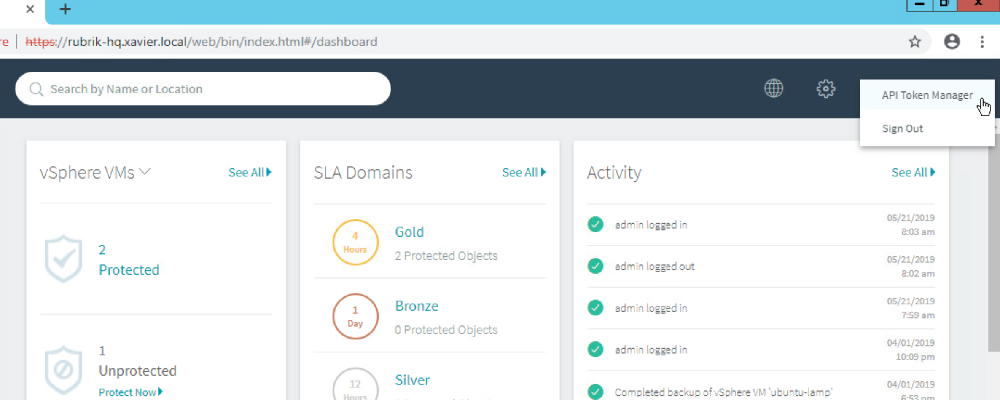
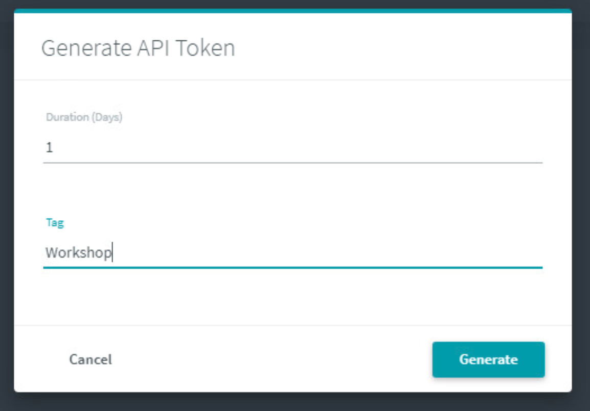
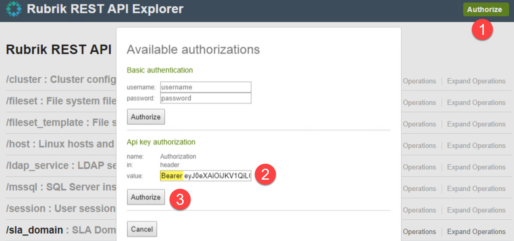
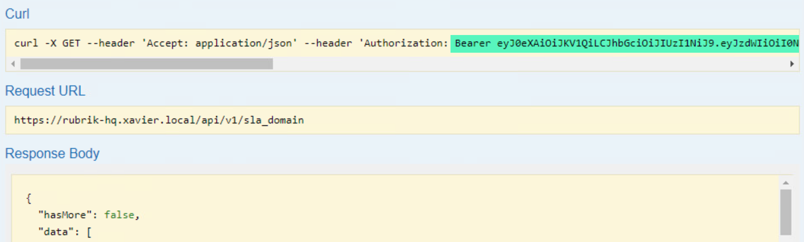

| Difficulty level: Intermediate |
| --- |

# Lesson 2: API Token

When looking to give API access without having to share a username and password, the API Token offers a solution. This lets you generate a token that has a specific lifetime for making API calls that are bound by the permissions and Role Based Access Control (RBAC) of a specific user.

In this lab, we will generate an API Token to use for requests to the Rubrik REST API.

## Lesson 1-1: Generate an API Token

In Google Chrome, open a new tab and type `https://$cluster_address/`. 

The Rubrik UI appears with a login prompt.

Log into the UI by entering the username and password and clicking **Sign In**.

Once in the UI, click on the **Admin User** link in the upper right corner. Next, choose **API Token Manager**.

From the API Token Manager screen, find the green "+" button in the upper right corner to add a new API Token. This will present the **Generate API Token** window. Use the following values:

1. Duration (Days): 1
1. Tag: Workshop

Click the **Generate** button.

A token will be displayed on the screen. Use the **Copy** button to copy the value to your clipboard. This will close the window and finish creating the API Token.

*Note: You may want to copy the token to your clipboard*

## Lesson 1-2: Using the API Token

In Google Chrome, open a new tab and type `https://$cluster_address/docs/v1/playground`. The node IP information can be found in [Lab Topology](/lab-topology.md).

The Rubrik REST API Explorer web page opens.

1. Click on the green Authorize button in the upper right corner.
1. Find the **API Key Authorization** section.
2. Supply the word `Bearer`, leave a space, and then paste the API Token from earlier into the `value` field.
3. Click **Authorize**.

The page will refresh using your new authorized token.

Fun Fact: The *Bearer* authentication scheme is dedicated to the authentication using a token and is described by the [RFC6750](https://tools.ietf.org/html/rfc6750).

## Lesson 1-3: Test an API Request

In Google Chrome, use the existing tab with the REST API Explorer. Navigate to the `sla_domain` set of endpoints and expand the `GET /sla_domain` endpoint.

Scroll down to the **Try it now!** button to run the request to retrieve all of the available SLA Domains. If you have entered the API Token correctly, a Response Body will appear in the bottom portion of the `sla_domain` endpoint.

Notice anything different about the **Curl** command information? The header now contains the bearer API token that has authenticated the request.

You have now completed the lab.
